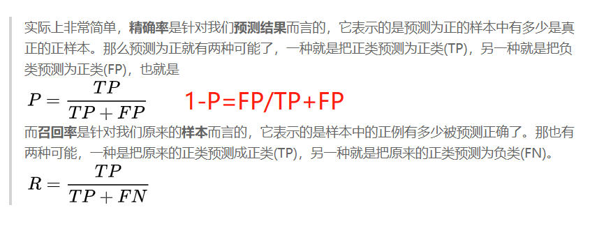

## Android Adversary for DNN

# 一 Analyze
实验分析文件夹
## CalculateFeature.py
计算全部软件和恶意软件的特征数量，1分位数，均值，3分位数，中位数

## evaluate_adv.py
选定一种分类器（加载一个特定的模型） 看不同攻击的效果（不同数据集）

正常恶意样本+良性软件的准确率，FNR，FPR

评价对抗样本+良性软件的准确率，FNR，FPR

正常和对抗计算误分类率(两个FNR相减)

## characteristicsAnalyse.py
分析不同攻击（样本）下的特征（kd,bua,buc,bue）区分效果
* 读取特征npy文件
* 比较npy文件
>1一个数 <1一个数

## evaluate_adversarytrain.py
评价在训练的模型

一共训练了两个模型 adversarial_jsmf_model.h5 adversarial_jsmf_model.h5

每个模型运行下不同的攻击测试样本得到指标

## evaluate_distillation.py

评价蒸馏的模型

一共训练了两个模型 /malwareclassification/models/distillation_model.h5

每个模型运行下不同的攻击测试样本得到指标

## evaluate_ensemble.py
评价多模型整合

# 二 data
数据文件夹

训练数据 x_train01.csv  y_train01.csv

测试数据  x_test01.csv  y_test01.csv 

一行测试数据 one_row.csv

对xxx_xxx架构下攻击得到对抗样本
## jsmf
原始恶意软件及其标签 
JSMF_xxx_xxx_X_normal.csv JSMF_xxx_xxx_Y_normal.csv
jsmf对抗恶意软件及其标签  
JSMF_200_200_X_adv.csv JSMF_200_200_Y_adv.csv

得到原始良性软件及其标签
JSMF_200_200__X_begin.csv JSMF_200_200__Y_begin.csv
## deepfool
原始恶意软件及其标签 
deepfool_xxx_xxx_X_normal.csv deepfool_xxx_xxx_Y_normal.csv
deepfool对抗恶意软件及其标签  
deepfool_200_200_X_adv.csv deepfool_200_200_Y_adv.csv

得到原始良性软件及其标签
deepfool_200_200__X_begin.csv deepfool_200_200__Y_begin.csv
## fgsm
原始恶意软件及其标签 
fgsm_xxx_xxx_X_normal.csv fgsm_xxx_xxx_Y_normal.csv
fgsm对抗恶意软件及其标签  
fgsm_200_200_X_adv.csv fgsm_200_200_Y_adv.csv

得到原始良性软件及其标签
fgsm_200_200__X_begin.csv fgsm_200_200__Y_begin.csv
## onefeature
原始恶意软件及其标签 
onefeature_xxx_xxx_X_normal.csv onefeature_xxx_xxx_Y_normal.csv
onefeature对抗恶意软件及其标签  
onefeature_200_200_X_adv.csv onefeature_200_200_Y_adv.csv

得到原始良性软件及其标签
onefeature_200_200__X_begin.csv onefeature_200_200__Y_begin.csv
## features
feature_names.csv

# 三 malwareclassification

## nn_grid_search.py

使用训练数据寻找不同架构DNN的最佳参数，使用Scikit-learn封装了Keras方法的GridSearchCV模块进行自动网格搜索，使用3倍交叉验证
返回最佳参数

create_model----200 200 （可以观察所有model 改变createmodel）

选定优化器adam

结果形式
 
    0.9577262851349082 0.002337225030502123 with {'batch_size': 50, 'bias_initializer': 'Zeros', 'dropout_rate': 0.2, 'epochs': 1, 'kernel_initializer': 'uniform', 'learn_rate': 0.001}

参考

[https://machinelearningmastery.com/use-keras-deep-learning-models-scikit-learn-python/](https://machinelearningmastery.com/use-keras-deep-learning-models-scikit-learn-python/)

[https://machinelearningmastery.com/grid-search-hyperparameters-deep-learning-models-python-keras/](https://machinelearningmastery.com/use-keras-deep-learning-models-scikit-learn-python/)

[https://www.davex.pw/2017/09/17/Cross-Validation/](https://www.davex.pw/2017/09/17/Cross-Validation/)
## models_grid_search.py
决策树，随机森林，k最近邻，逻辑回归和支持向量机的最佳参数
DT、RF、KNN、LR、SVM

## train_models.py
我们要训练不同架构的DNN和机器学习模型

DNN模型训练了13种架构

机器学习模型训练了9种

## evaluate_models.py
评价所有机器学习和DNN架构

选出三种架构的DNN架构，准确率高的，FNR低的，介于两者之间的。

## defensive_distillation.py

训练蒸馏模型保存到models/distillation_model.h5
过程中得到distilled-100为蒸馏模型  distilled-100初始模型 distilled-100_teacher教师模型

# 四 oneFeature文件夹(针对200_200以后换架构)
实施oneFeature攻击 
## tutorials文件夹
过程

* 在oneFeature攻击时
* 先进行deepfoolattack线性攻击（没用）
* 模拟退火oneFeature攻击

### tutorial_oneFeature_k.py
* 进行oneFeature测试 测试一个恶意软件生成一个对抗样本
* 返回扰动特征数量
* 得到对抗样本
* 画图
	* 过程（单个样本）每次特征取最好best那条曲线(修改几个特征几条曲线) 所有特征取平均（黑色虚线）      	量级相差特别大，为避免量级相差特别大的原因采用归一化
    * 结果（单个样本）bestvalue的曲线（每次修改特征的bestvalue）（目前只画出一个样本）(可能要多个样本进行比较) 
### oneFeatureattackall.py
* 进行oneFeature测试 测试整个测试集的恶意软件去生成对抗样本
* 返回平均扰动数量=扰动总数/恶意软件数量
* 针对某一架构DNN(到时候csv修改名字)
* 
	得到原始良性软件及其标签onefeature_200_200__X_begin.csv 
	onefeature_200_200__Y_begin.csv
	
	得到原始恶意软件及其标签 onefeature_xxx_xxx_X_normal.csv onefeature_xxx_xxx_Y_normal.csv
	
	得到对抗恶意软件及其标签  onefeature_200_200_X_adv.csv onefeature_200_200_Y_adv.csv

* 画图
	* 加时间戳---过程（单个样本）每次特征取最好best那条曲线(修改几个特征几条曲线) 所有特征取平均（黑色虚线）      	量级相差特别大，为避免量级相差特别大的原因采用归一化
    * 汇总起来---结果（多个样本）bestvalue的曲线（每次修改特征的bestvalue）
    	* 归一化 
    	* 多个样本进行比较

	* 不同攻击重复画即可（以后）
	

# 五 deepfool文件夹(针对200_200以后换架构)
实施deepfool+oneFeature攻击 
## tutorials文件夹
过程

* 在deepfool+oneFeature攻击时
* 先进行deepfoolattack线性攻击（有用，筛选索引）
* 模拟退火oneFeature攻击

### tutorial_deepfool_k.py
* 进行deepfool测试 测试一个恶意软件生成一个对抗样本
* 返回扰动特征数量
* 得到对抗样本
* 画图
	* 过程（单个样本）每次特征取最好best那条曲线(修改几个特征几条曲线) 所有特征取平均（黑色虚线）      	量级相差特别大，为避免量级相差特别大的原因采用归一化
    * 结果（单个样本）bestvalue的曲线（每次修改特征的bestvalue）（目前只画出一个样本）(可能要多个样本进行比较) 
### deepfooattackall.py
* 进行deepfool测试 测试整个测试集的恶意软件去生成对抗样本
* 返回平均扰动数量=扰动总数/恶意软件数量
* 针对某一架构DNN(到时候csv修改名字)
* 
	得到原始良性软件及其标签deepfool_200_200__X_begin.csv 
	deepfool_200_200__Y_begin.csv
	
	得到原始恶意软件及其标签 deepfool_xxx_xxx_X_normal.csv deepfool_xxx_xxx_Y_normal.csv
	
	得到对抗恶意软件及其标签  deepfool_200_200_X_adv.csv deepfool_200_200_Y_adv.csv

* 画图
	* 加时间戳---过程（单个样本）每次特征取最好best那条曲线(修改几个特征几条曲线) 所有特征取平均（黑色虚线）      	量级相差特别大，为避免量级相差特别大的原因采用归一化
    * 汇总起来---结果（多个样本）bestvalue的曲线（每次修改特征的bestvalue）
    	* 归一化 
    	* 多个样本进行比较

	* 不同攻击重复画即可（以后）

# 六 fgsmattack文件夹(针对200_200以后换架构)
实施fgsm+oneFeature攻击 
## tutorials文件夹
过程

* 在fgsm+oneFeature攻击时
* 先进行deepfoolattack线性攻击（无用）
* 模拟退火oneFeature攻击（FGSM每次迭代筛选索引）

### tutorial_fgsm_k.py
* 进行fgsm测试 测试一个恶意软件生成一个对抗样本
* 返回扰动特征数量
* 得到对抗样本
* 画图
	* 过程（单个样本）每次特征取最好best那条曲线(修改几个特征几条曲线) 所有特征取平均（黑色虚线）      	量级相差特别大，为避免量级相差特别大的原因采用归一化
    * 结果（单个样本）bestvalue的曲线（每次修改特征的bestvalue）（目前只画出一个样本）(可能要多个样本进行比较) 

### fgsm_attacktrainset.py
运行这攻击方法得到相应的训练数据的对抗样本 存放在data/adversarytrain中
为后续在训练提供对抗样本
### fgsmttackall.py
* 进行deepfool测试 测试整个测试集的恶意软件去生成对抗样本
* 返回平均扰动数量=扰动总数/恶意软件数量
* 针对某一架构DNN(到时候csv修改名字)
* 
	得到原始良性软件及其标签fgsm_200_200__X_begin.csv 
	fgsm_200_200__Y_begin.csv
	
	得到原始恶意软件及其标签 fgsm_xxx_xxx_X_normal.csv fgsm_xxx_xxx_Y_normal.csv
	
	得到对抗恶意软件及其标签  fgsm_200_200_X_adv.csv fgsm_200_200_Y_adv.csv

* 画图
	* 加时间戳---过程（单个样本）每次特征取最好best那条曲线(修改几个特征几条曲线) 所有特征取平均（黑色虚线）      	量级相差特别大，为避免量级相差特别大的原因采用归一化
    * 汇总起来---结果（多个样本）bestvalue的曲线（每次修改特征的bestvalue）
    	* 归一化 
    	* 多个样本进行比较

	* 不同攻击重复画即可（以后）

# 七 JSMF文件夹(针对200_200以后换架构)
## tutorial_jsmf_k.py
对几个恶意软件进行jsmf攻击

得到原始恶意软件及其标签

得到原始良性软件及其标签

得到对抗恶意软件及其标签

得到平均干扰

## attackall_jsmf.py
对测试集恶意软件进行jsmf攻击 

得到原始良性软件及其标签JSMF_200_200__X_begin.csv 
JSMF_200_200__Y_begin.csv

得到原始恶意软件及其标签 JSMF_xxx_xxx_X_normal.csv JSMF_xxx_xxx_Y_normal.csv

得到对抗恶意软件及其标签  JSMF_200_200_X_adv.csv JSMF_200_200_Y_adv.csv

保存到/data/jsmf  
得到平均干扰

## 8 jsmf_attacktrainset.py
运行jsmf攻击方法得到相应的训练数据的对抗样本 存放在data/adversarytrain
为后续在训练提供样本

# 八 第二种攻击模式 secondattack
* data/codefeature.xls筛选哪些特征(code）不能攻击
## deepfool
tutorials/deepfoolattackall_second.py 生成第二种攻击模型下的对抗样本
## fgsmattak
tutorials/fgsmattackall_second.py 生成第二种攻击模型下的对抗样本
## jsmf
attackall_jsmf_second.py 生成第二种攻击模型下的对抗样本
## onefeature
tutorials/oneFeatureattackall_second.py 生成第二种攻击模型下的对抗样本

	
 

# 九 defence文件夹(只针对200_200一个架构)
## detector
### extract_characteristics.py
对不同攻击（样本）得到两种特征lid,kd

运行的参数 -a deepfool -r lid -k 20 -b 100

-a 'jsmf', 'deepfool', 'onefeature', 'fgsm'

-r 'kd','lid'

# 重新设置bandwith*** （难待突破）

### Uncertainty(文件夹--提取不确定性）
#### train_pytorh_model.py
训练一个pytorch版本的模型 模型存放在Uncertainty/model下 保存为dnn.pkl

#### extract_conbineFuture.py
对应的攻击样本提取 攻击作为参数 去对应的data/攻击文件夹下提取数据

攻击的参数

    'jsmf', 'deepfool', 'onefeature', 'fgsm'

目前的方法

两次提取 
normal提取一遍 攻击_200_200_X_normal.csv 得到三种不确定性文件 攻击_x_adv_不确定性.csv

adv提取一遍 攻击_200_200_X_adv.csv 得到三种不确定性文件 攻击_x_normal_不确定性.csv

#### featuretoNpy.py
对不同攻击，三种不确定性的normal和adv合并

攻击参数

    'jsmf', 'deepfool', 'onefeature', 'fgsm'

对每一种攻击 在data/characteristic 得到攻击_bua.npy、攻击_bue.npy、攻击_buc.npy 

提取的文件到npy形式

### detect_adv_examples.py
训练集攻击-a 'jsmf', 'deepfool', 'onefeature', 'fgsm' 测试集攻击 -t 'jsmf', 'deepfool', 'onefeature', 'fgsm'

-r 

kd 

lid

kd,lid

bua,bue,buc

kd,lid,bua,bue,buc

### detect_and_detect.py
经过检测器在经过分类器
## adversarytrain（再训练）
### adversarial_train.py
运行defence/adversarytrain/adversarial_train.py

将得到的fgsm和jsmf对抗样本分别与训练数据混合训练（操作两次 更改读取数据 保存模型）

得到模型
adversarial_jsmf_model.h5

adversarial_jsmf_model.h5

# 十 服务器上的操作
## 1 平均扰动针对三个攻击模型(服务器上待做)--已完成
直接运行所有攻击文件夹下的attackall
 

不同架构DNN重复上述操作 换加载模型，换生成样本的名字fgsm_xxx_xxx_X_begin.csv
## 2 选定一DNN模型不同攻击样本的准确率，FNR---以及误分类率
 

运行Analyze/evaluate_adv.py
* 对于同一模型加载不同对抗样本 得到一个表的数据
* 不同架构DNN重复上述操作 换加载模型 得到所有表的数据

## 3 第二种攻击模式重复上述操作

## deepfool
tutorials/deepfoolattackall_second.py 生成第二种攻击模型下的对抗样本
## fgsmattak
tutorials/fgsmattackall_second.py 生成第二种攻击模型下的对抗样本
## jsmf
attackall_jsmf_second.py 生成第二种攻击模型下的对抗样本
## onefeature
tutorials/oneFeatureattackall_second.py 生成第二种攻击模型下的对抗样本

得到平均扰动的图和攻击模型准确率

## 4 提取不同攻击对应的对抗样本的特征kd,lid
extract_characteristics.py
不断更换参数
-a 'jsmf', 'deepfool', 'onefeature', 'fgsm'

-r 'kd','lid'

得到data/characteristic下八个文件

## 5 提取不同攻击对应的对抗样本的三种确定性特征
extract_combineFuture.py

不停的换参数'jsmf', 'deepfool', 'onefeature', 'fgsm' 在对应data/攻击文件夹得到 得到六种不确定性文件 攻击_x_adv_不确定性.csv、攻击_x_normal_不确定性.csv

featuretoNpy.py

不停地换参数'jsmf', 'deepfool', 'onefeature', 'fgsm' 

对每一种攻击 在data/characteristic 得到攻击_bua.npy、攻击_bue.npy、攻击_buc.npy 

## 6 分析kd,bu在不同攻击下的区分效果
运行 characteristicsAnalyse.py

-a fgsm -r kd，bua,buc,bue

对应参数攻击参数
'jsmf', 'deepfool', 'onefeature', 'fgsm'

一次填

kd,bua,buc,bue

不停换攻击参数得到图表

 

## 7 检测分类器训练和检测

训练集攻击

-a jsmf  或者 -a onefeature

测试集攻击 -t 'jsmf', 'deepfool', 'onefeature', 'fgsm'

-r 

kd 

lid

kd,lid

bua,bue,buc

kd，lid,bua,bue,buc

 

## 8 攻击训练样本得到fgsm,jsmf两种训练样本的对抗样本
运行这两种攻击方法得到相应的训练数据的对抗样本 存放在data/adversarytrain
fgsm/tutorials/fgsm_attacktrainset.py
jsmf/tutorials/jsmf_attacktrainset.py

## 9 训练两种对抗样本模型（jsmf,fgsm）
运行defence/adversarytrain/adversarial_train.py

将得到的fgsm和jsmf对抗样本分别与训练数据混合训练（操作两次 更改读取数据 保存模型）

得到模型
adversarial_jsmf_model.h5

adversarial_jsmf_model.h5

## 10 评价在训练的模型

Analyze/evaluate_adversarytrain.py

共两个模型 adversarial_jsmf_model.h5 adversarial_jsmf_model.h5

每个模型运行下平均不同的攻击测试样本

 

## 11 训练&&评价蒸馏模型
运行defensive_distillation.py在T=150情况下

训练蒸馏模型保存到models/distillation_model.h5

运行evaluate_distillation.py

每个模型运行下不同的攻击测试样本得到指标

 

## 	12 ensemble
对不同攻击样本预测，联合分类器的结果
 
## 13 detector 评价
用detector的评价指标乘以原始dnn的评价
 

 

FNR:原始DNN的FNR+detector的1-P

误分类率 1-detector的准确率

准确率 两个准确率相乘

* detect_and_detect.py
	* 经过检测器 对抗样本--->恶性 
				非对抗样本
						--->分类器---->良性
								 ---->恶性	

            if perturbationsindex.size == 0:
                perturbationsindex=np.array(list(range(0,25000)))

